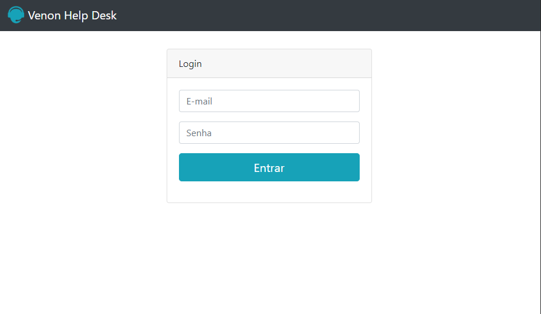
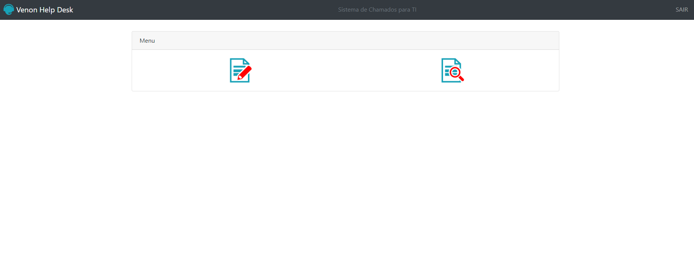
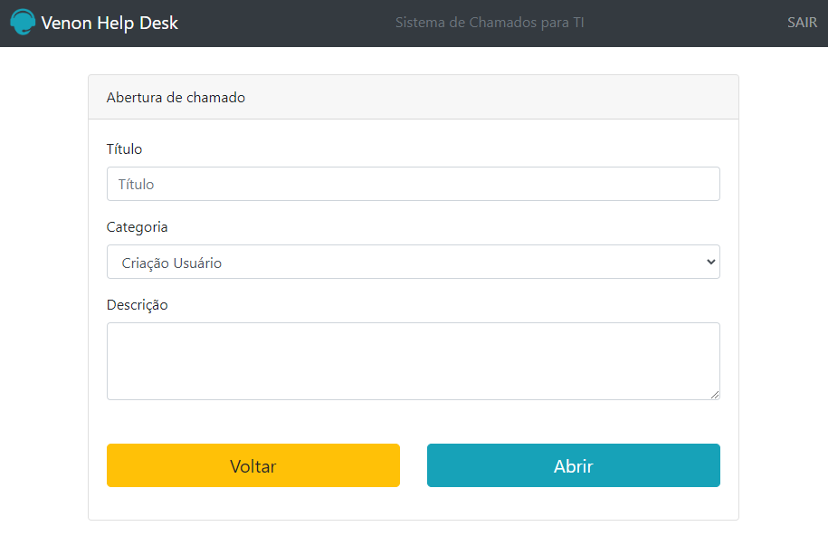

## Descrição do projeto

<h1 align="center">Venon Help Desk</h1>

🚀 Projeto Web para colocar em pratica os conhecimentos em PHP 

 <a href="#objetivo">Objetivo</a> •
 <a href="#roadmap">Roadmap</a> • 
 <a href="#tecnologias">Tecnologias</a> • 
 <a href="#autor">Autor</a>

<h2 id="objetivo">Objetivo</h2>

Colocar em práticas os conhecimentos sobre o PHP, conforme consultado na documentação 

<h2 id="roadmap">Roadmap</h2>

Um Sistema Web de abertura de chamado criado 100% em PHP, os dados foram  mockados  para exemplificar um SGDB, criado desta forma  para colocar em praticas as funções nativas do PHP 

<h2 id="tecnologias">🛠 Tecnologias</h2>

As seguintes ferramentas foram usadas na construção do projeto:

- [PHP](https://www.php.net/docs.php)

<h2 id="autor">Autor</h2>

<h3 align="center">
    
    
    
    
</h3>
